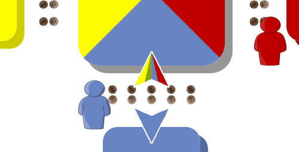
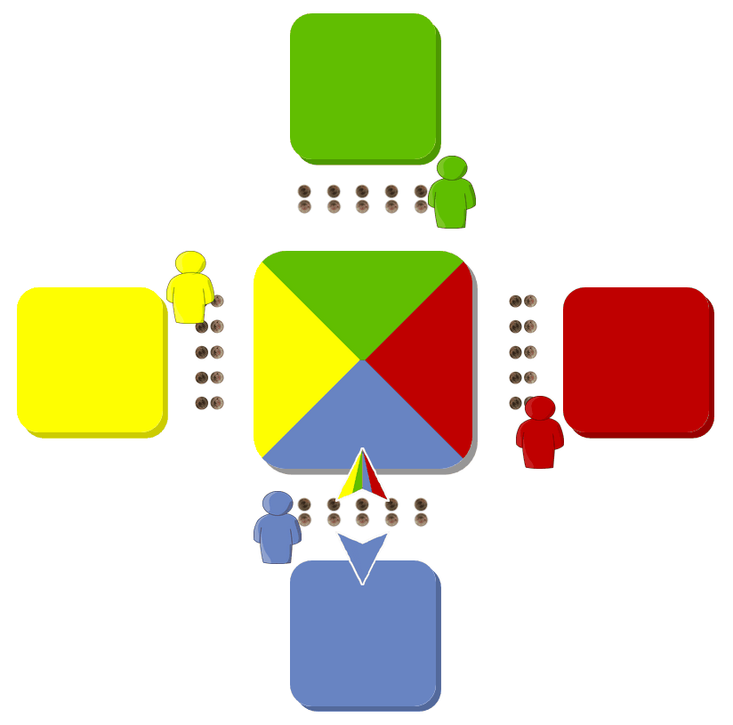
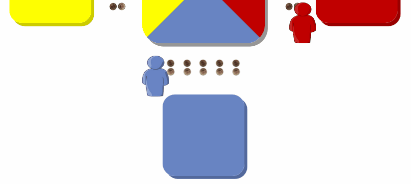
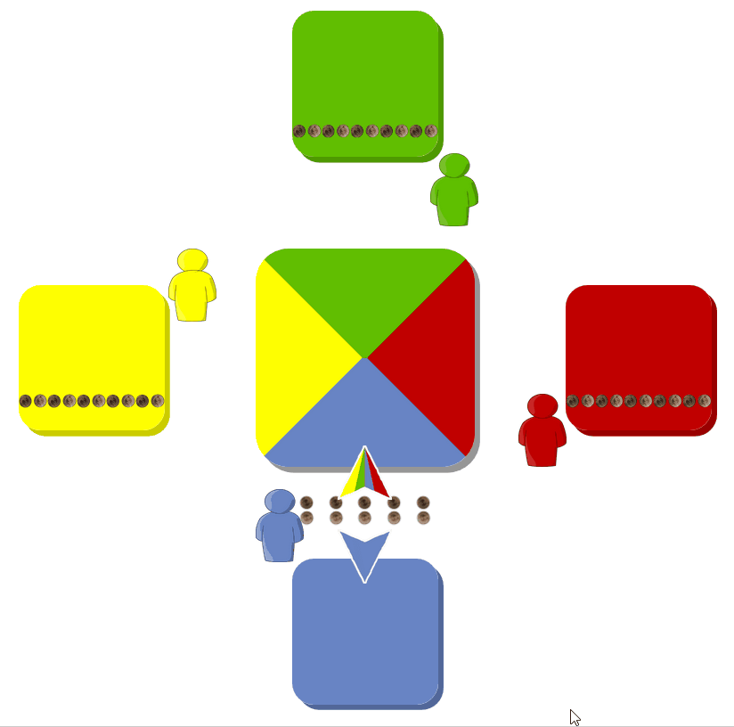
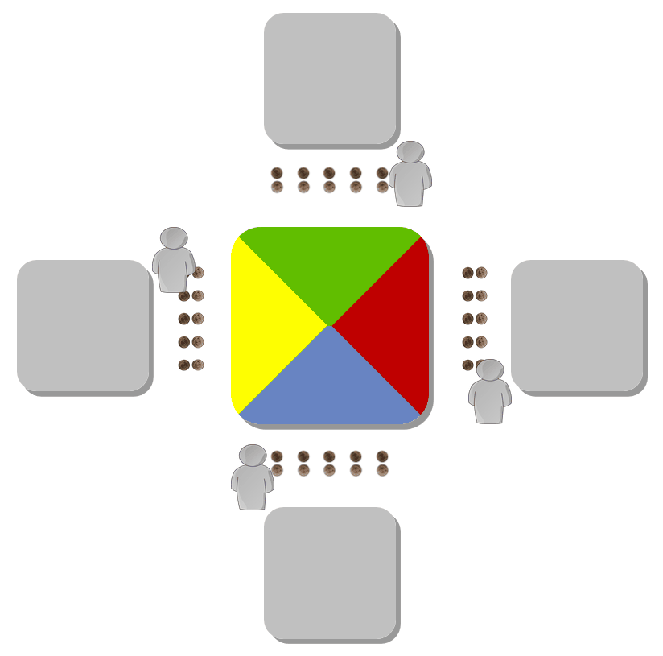
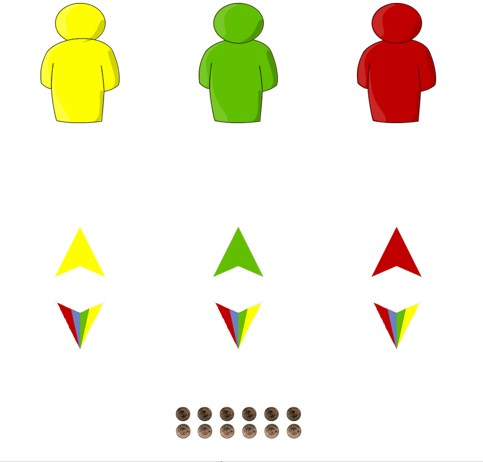
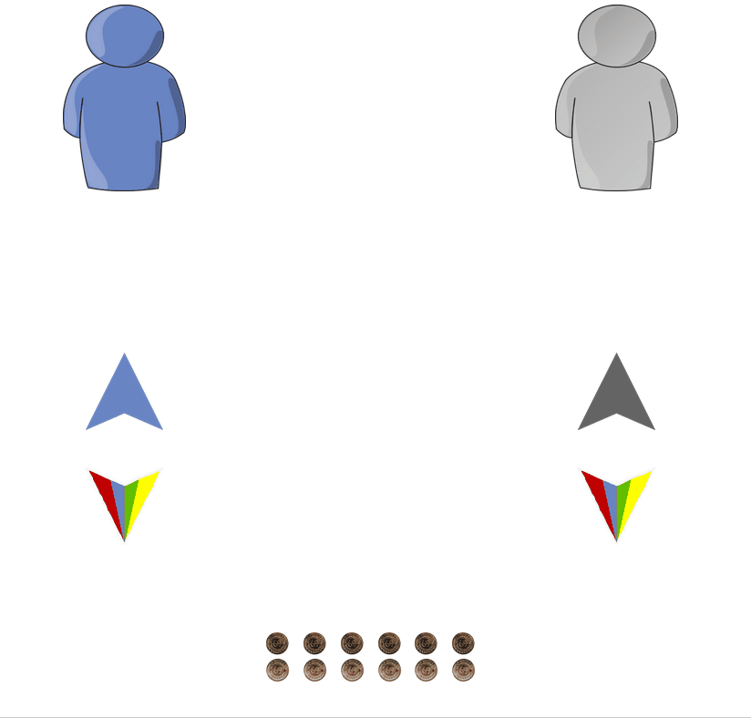

# Public Goods Game
The public goods game is a standard of experimental economics - [read more on Wikipedia](https://en.wikipedia.org/wiki/Public_goods_game). This project is an [oTree application](https://otree.readthedocs.io/) for a 4-player public goods game to be played in a browser. At first, the player gets instructed via audio and animations:

The participant takes the role of the blue player and proceeds through the app by touchscreen or mouse interaction. With a test run the participant can get familiar with the controls:

The actual game is played with three other real participants. Everyone decides how many coins he wants to put into the community pot and how many to keep for himself. After all participants confirmed their decision, the result is displayed to everyone:

## Game variations
### UK Strategy

The participant is only allowed to move all coins at once into one of the pots:

### K Strategy

The participant can still only move all coins at once. Furthermore, he gets shown beforehand how the other players decided to move their coins:

### Third party punishment

The participant is introduced to some ficticious players and their strategies:
- yellow player: always keeps all coins for himself
- green player: always puts all coins into the community pot
- red player: puts all coins into the community pot if all others do the same, otherwise keeps coins for himself

With this information in mind, the participant now has to distribute some additional coins among the three players (yellow, green and red):

### Dictator

In the same fashion as with _third party punishment_, the participant has to distribute some additional coins between himself and another random participant:

At the end the participant gets shown how many coins he earned during the session.

# Installation
To use this Django application you need to install oTree, which is a software platform for economics experiments.
- [official oTree Homepage](http://www.otree.org)
- [Installation Guidelines](https://otree.readthedocs.io/en/latest/install.html)
- [oTree on GitHub](https://github.com/oTree-org) (just for the curious)

If you have Python 3 already installed, you only need to run `pip3 install -U otree` in a terminal.

## Start the application
Clone or download this repository to your device. Jump inside the directory and open a terminal window (e.g. PowerShell on Windows). Enter `otree devserver`.
Open your browser and enter http://127.0.0.1:8000 in the address bar. You will have access to invitation links for participants in the same network.

Remark: While this works for a small number of concurrent participants in a local network, you might want to consider hosting the application on a server. Read the [corresponding chapter in the oTree documentation](https://otree.readthedocs.io/en/latest/server/intro.html) for further details.

## Further requirements
To ensure the desired sequence of events, the browser should **allow autoplay** of audio files. Otherwise it is possible that the audio instructions won't start. A series of successful experiments was conducted with tablets (Acer Iconia One 10) using the [Fully Kiosk Browser](https://www.ozerov.de/fully-kiosk-browser/) which has a setting to impose no restrictions on autoplay.

# Disclaimer
If you publish research conducted using oTree, you are required by the oTree license to cite [this paper](http://dx.doi.org/10.1016/j.jbef.2015.12.001). (Citation: Chen, D.L., Schonger, M., Wickens, C., 2016. oTree - An open-source platform for laboratory, online and field experiments. Journal of Behavioral and Experimental Finance, vol 9: 88-97)